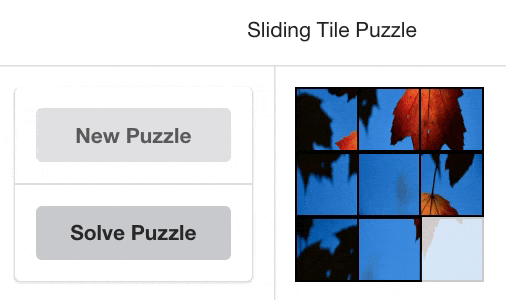

# react-sliding-tile-puzzle

A Sliding Tile Puzzle!



-   react-sliding-tile-puzzle makes use of AI to find a solution to the puzzle.

-   AI algorithm: A<sup>\*</sup> with cost function = min(f(x)), where f(x) = h(x) + g(x), h(x) = manhattan distance and g(x) = height of tree.

-   Other algorithms will be added to this module soon. The idea is to use this kind of puzzle to compare/demonstrate various algorithms.

\* The use of images (as tiles) will be implemented soon.

**Demo**

http://AmauriAires.github.io/react-sliding-tile-puzzle

**Installation**

```
npm install react-sliding-tile-puzzle --save
```

**Props**

| Prop Name     | Type   | Is Required | Default Value | Description                                                            |
| ------------- | ------ | ----------- | ------------- | ---------------------------------------------------------------------- |
| solvePuzzle   | bool   | optional    |               | Tells AI algorithm to solve puzzle.                                    |
| newPuzzle     | bool   | optional    |               | Tells component to create a new puzzle. Suffle pattern board.          |
| maxIterations | number | optional    | 50            | Max number of tile moves allowed for AI algorithm to solve the puzzle. |
| image         | string | required    |               | Image for tiles                                                        |
| size          | number | required    |               | Puzzle dimensions (height x width = size x size ) in px                |

**Usage**

```javascript
import React, { Component } from 'react';
import './App.css';
import SlidingTilePuzzle from 'react-sliding-tile-puzzle';
import { Button, Segment } from 'semantic-ui-react';

class App extends Component {
    constructor(props) {
        super(props);
        this.state = {
            solvePuzzle: false,
            newPuzzle: false,
        };
    }

    handleClickSolvePuzzle = () => {
        this.setState({ solvePuzzle: !this.state.solvePuzzle });
    };

    handleClickNewPuzzle = () => {
        this.setState({ newPuzzle: !this.state.newPuzzle });
    };

    render() {
        return (
            <div className="App">
                <Segment.Group>
                    <Segment>Sliding Tile Puzzle</Segment>
                    <Segment.Group horizontal>
                        <Segment.Group vertical="true">
                            <Segment>
                                <Button
                                    fluid
                                    onClick={this.handleClickNewPuzzle}
                                >
                                    New Puzzle
                                </Button>
                            </Segment>
                            <Segment>
                                <Button
                                    fluid
                                    onClick={this.handleClickSolvePuzzle}
                                >
                                    Solve Puzzle
                                </Button>
                            </Segment>
                        </Segment.Group>
                        <Segment>
                            <SlidingTilePuzzle
                                solvePuzzle={this.state.solvePuzzle}
                                newPuzzle={this.state.newPuzzle}
                                maxIterations={300}
                                image="serenity-mitchell-1163490-unsplash.jpg"
                                size={130}
                            />
                        </Segment>
                    </Segment.Group>
                </Segment.Group>
            </div>
        );
    }
}

export default App;
```
